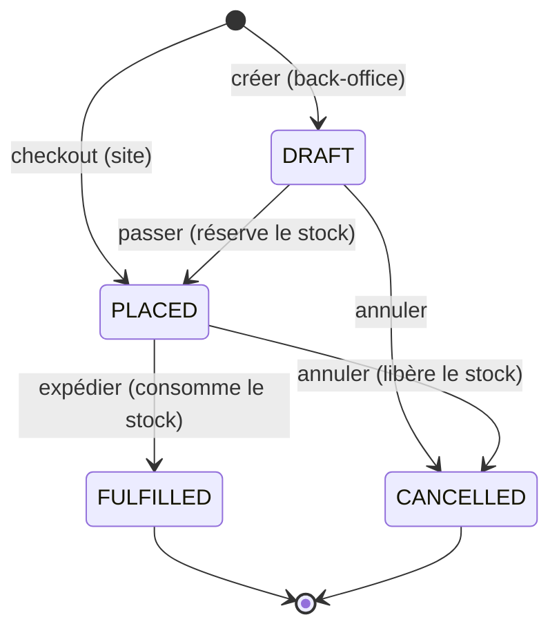
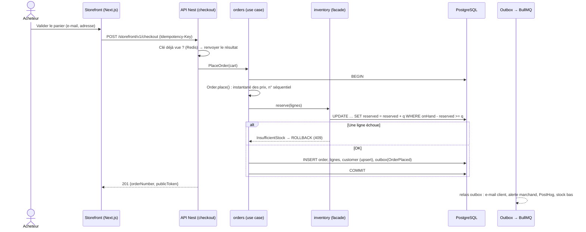
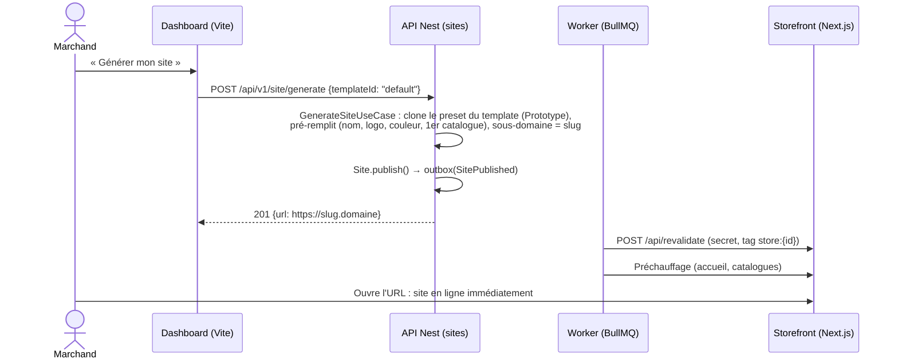
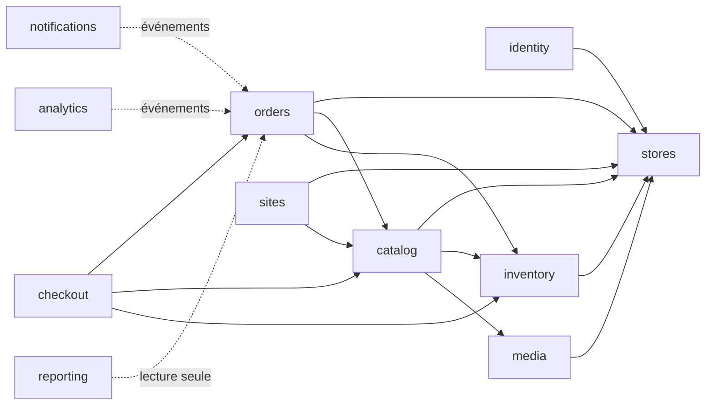
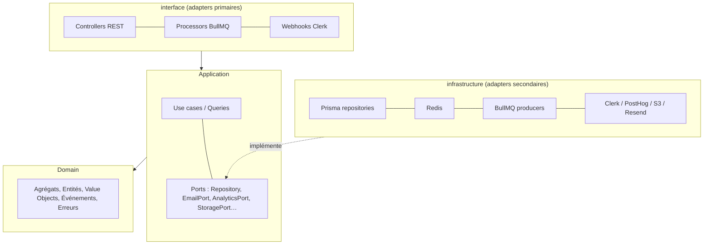
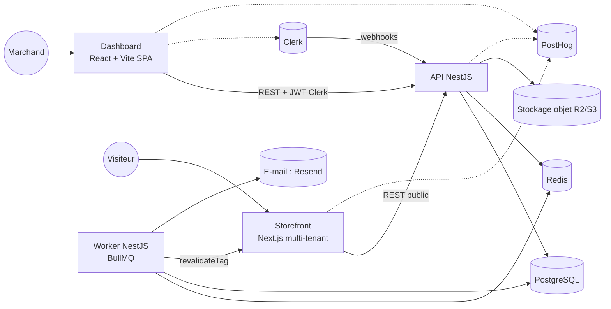
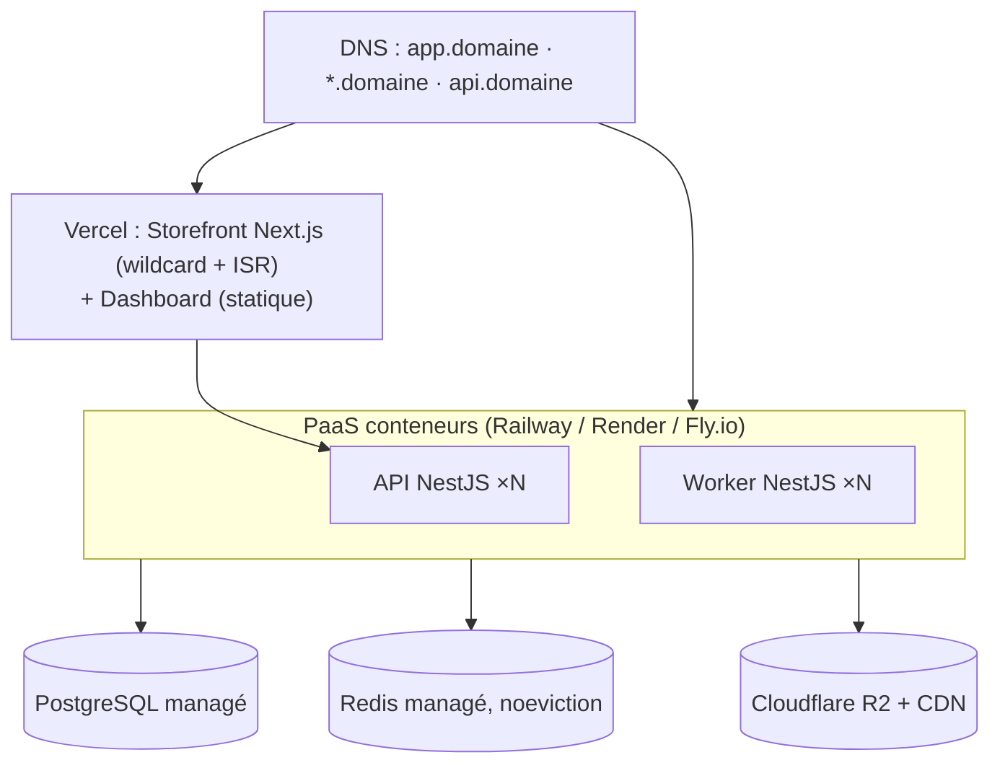
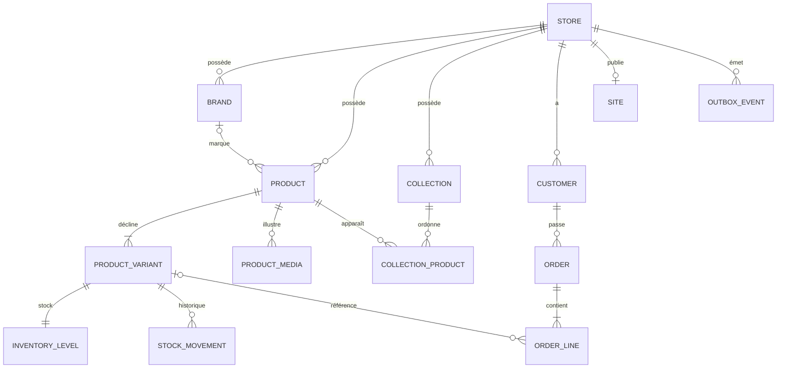

# Marché : document d'architecture

> ERP e-commerce SaaS « à la Shopify », avec génération de site en un clic.
>
> **Version** : 0.1 · **Date** : 2026-09-26 · **Statut** : validé, sert de référence avant l'implémentation.
> **Document suivant** : `docs/PLAN-CODE.md` (plan d'implémentation détaillé).

## Sommaire
1. [Vision et périmètre](#1-vision-et-périmètre)
2. [Langage du domaine (glossaire)](#2-langage-du-domaine-glossaire)
3. [Use cases](#3-use-cases)
4. [Architectures : explications et décisions](#4-architectures--explications-et-décisions)
5. [Design patterns](#5-design-patterns)
6. [Stack technique](#6-stack-technique)
7. [Modèle de données (vue logique)](#7-modèle-de-données-vue-logique)
8. [API : conventions et endpoints principaux](#8-api--conventions-et-endpoints-principaux)
9. [Structure du monorepo](#9-structure-du-monorepo)
10. [Sécurité, qualité, observabilité, tests](#10-sécurité-qualité-observabilité-tests)
11. [Roadmap de réalisation](#11-roadmap-de-réalisation)

**Stack imposée** : NestJS (back), React + Vite.js et Next.js (front), Tailwind CSS, shadcn/ui, Motion (motion.dev), Clerk (auth), PostgreSQL + Prisma, Redis, BullMQ, PostHog.

**Point de départ** : `backend/` contient un scaffold NestJS 12 vierge (ESM, Vitest, oxlint, `@nestjs/observe`). Il sera déplacé dans `apps/api` en phase 0.

---

## 1. Vision et périmètre

### 1.1 Vision
Un marchand s'inscrit, crée sa boutique, ajoute ses **marques**, ses **produits** (avec variantes et images), gère son **stock**, organise ses **catalogues** et traite ses **commandes**. Un bouton **« Générer mon site »** met aussitôt en ligne une boutique web. Elle utilise le **template par défaut** de la plateforme et se branche en direct sur les données de l'ERP.

### 1.2 Acteurs
| Acteur | Description |
|---|---|
| **Marchand (Owner)** | Crée et administre sa boutique. Il se connecte via Clerk. |
| **Membre (Staff)** | Collaborateur invité dans la boutique (rôle restreint), en V2. |
| **Acheteur / visiteur** | Navigue sur le site généré et passe commande en invité, sans compte. |
| **Système** | Workers BullMQ : e-mails, revalidation du site, alertes de stock, outbox. |
| **Services externes** | Clerk (identité), PostHog (analytics), stockage objet, fournisseur d'e-mail. |

### 1.3 Périmètre
| MVP (dans le périmètre) | Hors MVP (V2+) |
|---|---|
| Auth + onboarding boutique | Équipes et rôles fins |
| Marques (CRUD) | Import/export CSV |
| Produits + variantes + images + statut | Promotions, codes promo |
| Catalogues (collections manuelles, ordonnées) | Collections automatiques (règles) |
| Stock : niveau, ajustements, historique, alertes de stock bas | Multi-entrepôts, transferts |
| Commandes : brouillon back-office, passage, paiement marqué manuellement, expédition, annulation | Paiement en ligne (Stripe, Mobile Money…), remboursements |
| Clients (créés automatiquement à la commande) | Comptes acheteurs |
| Génération du site (template par défaut, sous-domaine), personnalisation du thème, publication | Domaines personnalisés, plusieurs templates, éditeur visuel |
| Panier + checkout invité sur le site | Taxes et livraison avancées |
| Tableau de bord (CA, commandes, ruptures) + PostHog | Rapports avancés |

### 1.4 Hypothèses (à confirmer ou corriger)
1. **SaaS multi-tenant** : plusieurs marchands, chacun avec une boutique isolée. **1 organisation Clerk = 1 boutique.**
2. **Paiement en ligne hors MVP** : une commande passée est « non payée ». Le marchand la marque payée (paiement à la livraison, virement…). Un port `PaymentGateway` est prévu pour brancher Stripe ou Mobile Money en V2.
3. Les sites sont servis sur `{boutique}.<domaine-plateforme>` (le nom de domaine reste à choisir).
4. Un seul emplacement de stock par boutique en MVP.
5. Langue FR. **La devise est choisie par boutique** (EUR, XOF…). Les prix sont saisis TTC et il n'y a pas de moteur de taxes en MVP.

### 1.5 Exigences non fonctionnelles
| Exigence | Cible |
|---|---|
| Performance storefront | LCP < 2,5 s (pages en cache ISR/CDN) |
| Performance API | p95 < 300 ms sur les lectures back-office |
| Isolation | Aucune fuite de données entre boutiques (testée automatiquement) |
| Cohérence du stock | Jamais de survente : réservation atomique |
| Disponibilité | API sans état, redémarrable, horizontalement scalable |
| Sécurité et RGPD | Hébergement UE, consentement analytics sur les storefronts, secrets hors du code |
| Accessibilité | WCAG AA sur le template par défaut ; `prefers-reduced-motion` respecté |

---

## 2. Langage du domaine (glossaire)
| Terme (FR) | Code | Définition |
|---|---|---|
| Boutique | `Store` | Le tenant, dont toutes les données dépendent. |
| Marque | `Brand` | Marque commerciale rattachée à des produits. |
| Produit | `Product` | Fiche : titre, description, images, statut `DRAFT/ACTIVE/ARCHIVED`. |
| Variante | `ProductVariant` | Déclinaison vendable (SKU, prix, options taille/couleur). **Un produit a toujours au moins une variante.** |
| Catalogue | `Collection` | Groupe ordonné de produits, affiché sur le site. |
| Stock | `InventoryLevel` | `enMain` (onHand) et `réservé` par variante. Disponible = enMain − réservé. |
| Mouvement de stock | `StockMovement` | Journal immuable des variations de `enMain`. |
| Commande | `Order` | Statuts `DRAFT → PLACED → FULFILLED`, ou `CANCELLED`. Paiement `UNPAID / PAID`. |
| Ligne de commande | `OrderLine` | **Instantané** (titre, SKU, prix) figé au passage de la commande. |
| Client | `Customer` | Acheteur, identifié par son e-mail au sein de la boutique. |
| Site | `Site` | Storefront publié : sous-domaine, template, réglages de thème, statut. |
| Template | `Template` | Famille de composants et de sections qui définit le rendu d'un site. |

---

## 3. Use cases

### 3.1 Catalogue des use cases
| ID | Use case | Acteur | Module | Prio |
|---|---|---|---|---|
| UC-01 | S'inscrire / se connecter | Marchand | identity (Clerk) | MVP |
| UC-02 | Créer sa boutique (nom, slug, devise, pays) | Marchand | stores | MVP |
| UC-03 | Modifier les paramètres de la boutique (logo, contact) | Marchand | stores | MVP |
| UC-04 | Inviter un membre | Marchand | identity | V2 |
| UC-10 | Créer / modifier / archiver une marque | Marchand | catalog | MVP |
| UC-11 | Créer un produit (variantes, prix, stock initial) | Marchand | catalog | MVP |
| UC-12 | Gérer les variantes (options, SKU, prix) | Marchand | catalog | MVP |
| UC-13 | Téléverser les images d'un produit | Marchand | media | MVP |
| UC-14 | Publier / dépublier / archiver un produit | Marchand | catalog | MVP |
| UC-15 | Dupliquer un produit | Marchand | catalog | MVP |
| UC-16 | Créer un catalogue et y ordonner des produits | Marchand | catalog | MVP |
| UC-17 | Rechercher et filtrer les produits | Marchand | catalog | MVP |
| UC-20 | Ajuster le stock (réception, correction, perte + motif) | Marchand | inventory | MVP |
| UC-21 | Consulter l'historique des mouvements | Marchand | inventory | MVP |
| UC-22 | Recevoir une alerte de stock bas | Système | inventory → notifications | MVP |
| UC-30 | Créer une commande manuelle (brouillon) | Marchand | orders | MVP |
| UC-31 | **Passer une commande** (réserve le stock) | Marchand / Acheteur | orders | MVP |
| UC-32 | Marquer une commande payée | Marchand | orders | MVP |
| UC-33 | Expédier une commande (consomme le stock) | Marchand | orders | MVP |
| UC-34 | Annuler une commande (libère le stock) | Marchand | orders | MVP |
| UC-35 | Lister, filtrer et consulter les commandes | Marchand | orders | MVP |
| UC-36 | Consulter les clients et leur historique | Marchand | orders | MVP |
| UC-40 | **Générer le site en un clic** | Marchand | sites | MVP |
| UC-41 | Personnaliser le thème (logo, couleurs, textes, catalogue mis en avant) | Marchand | sites | MVP |
| UC-42 | Prévisualiser / publier / dépublier le site | Marchand | sites | MVP |
| UC-43 | Parcourir le site (accueil, catalogue, fiche produit) | Visiteur | storefront | MVP |
| UC-44 | Gérer son panier | Visiteur | checkout | MVP |
| UC-45 | **Checkout invité** (devient UC-31) | Acheteur | checkout → orders | MVP |
| UC-46 | Revalider le site après une modification du catalogue | Système | sites | MVP |
| UC-47 | Relier un domaine personnalisé | Marchand | sites | V2 |
| UC-50 | Voir le tableau de bord (CA, commandes, ruptures) | Marchand | reporting | MVP |
| UC-51 | Envoyer les e-mails transactionnels (confirmation, nouvelle commande) | Système | notifications | MVP |

### 3.2 Règles métier (invariants)
- **R1** : le SKU et le slug (handle) d'un produit sont uniques **par boutique**.
- **R2** : un produit a toujours au moins une variante, et un prix est toujours ≥ 0 (entier en **unités mineures**, jamais de flottant).
- **R3** : un produit ne passe `ACTIVE` que s'il a un titre, au moins une variante et un prix.
- **R4** : disponible = enMain − réservé ≥ 0. Jamais de stock négatif.
- **R5** : passer une commande réserve le stock de **toutes** les lignes de façon atomique : tout ou rien.
- **R6** : les lignes de commande figent le titre, le SKU et le prix unitaire au moment du passage.
- **R7** : les transitions de statut sont contrôlées (voir la machine à états). L'annulation libère la réservation. L'expédition décrémente `enMain` et `réservé`.
- **R8** : le numéro de commande est séquentiel par boutique (#1001, #1002…).
- **R9** : une boutique n'accède jamais aux données d'une autre.
- **R10** : on peut générer le site à tout moment. Sans produit actif, il affiche un état « Bientôt disponible ».

### 3.3 Machine à états de la commande

Le statut de paiement est orthogonal : `UNPAID → PAID` (manuel en MVP), puis `REFUNDED` en V2.

### 3.4 Use cases détaillés

**UC-11 : Créer un produit**
- *Préconditions* : marchand authentifié, boutique active.
- *Scénario* : il saisit le titre, la description, la marque, les options, les variantes (SKU, prix, stock initial) et les images (déjà téléversées) → `CreateProductUseCase` → l'agrégat `Product.create()` valide R1 à R3 → l'inventaire est initialisé dans la **même transaction** → événement `ProductCreated` (outbox).
- *Erreurs* : SKU ou slug en doublon (409), validation (422).

**UC-20 : Ajuster le stock**
- Il saisit une quantité signée et un motif → `AdjustStockUseCase` → mise à jour de `onHand` + écriture d'un `StockMovement` (même transaction). Si disponible < seuil, émission de `StockLow`.

**UC-31 / UC-45 : Passer une commande**


**UC-40 : Générer le site en un clic**

Ensuite, chaque modification (produit, stock, thème) émet un événement. Le worker revalide alors les pages concernées grâce aux **tags de cache**.

---

## 4. Architectures : explications et décisions

### 4.1 Architecture applicative (macro)
| Style | Principe | + | − | Verdict |
|---|---|---|---|---|
| **Monolithe classique** | Un seul déployable, code non cloisonné | Simple | Devient une « big ball of mud », couplage fort | ❌ |
| **Monolithe modulaire** | Un déployable, découpé en **modules métier isolés** (API publique, données possédées) | Simplicité de déploiement, transactions ACID locales, frontières nettes, extraction future possible | Demande de la discipline sur les frontières | ✅ **Choisi** |
| **Microservices** | Services indépendants, une base par service, communication réseau | Scalabilité et autonomie par équipe | Cohérence distribuée (sagas), observabilité, coût d'infra ; surdimensionné pour 1 à 3 devs | ❌ pour le MVP |
| **SOA** | Services d'entreprise réutilisables, souvent via un ESB et des contrats lourds | Intégration de SI hétérogènes | Lourd, orienté grands comptes | ❌ |
| **Serverless / FaaS** | Fonctions éphémères | Coût à l'usage | Incompatible avec des workers BullMQ de longue durée | ⚠️ seulement pour l'hébergement du storefront |
| **Event-driven** | Communication par événements | Découplage | Complexité si c'est le paradigme unique | ✅ **en interne** (événements + files) |

**Décision : monolithe modulaire NestJS**, déployé en **2 processus** depuis le même code : `api` (HTTP) et `worker` (BullMQ).

**Pourquoi** : la prise de commande et la réservation de stock doivent être **atomiques** (R5). Dans un monolithe, c'est une transaction Postgres. En microservices, il faudrait une saga. L'équipe est petite, et les modules bien cloisonnés permettront d'extraire un service plus tard (par exemple `sites` ou `notifications`) si la charge l'exige.

**Règles de modularité**
1. Un module = un **bounded context** : il possède ses tables, et aucun autre module ne les lit ni ne les écrit directement.
2. Un module n'expose que sa **façade** (`CatalogFacade`, `InventoryFacade`…) et ses **événements**. Aucun import de ses repositories ou entités.
3. Les dépendances sont acycliques, et leur respect est vérifié en CI par `dependency-cruiser`.


(A → B signifie « A utilise la façade de B ».)

**Modules** : `identity` (utilisateurs, webhooks Clerk, guards), `stores` (boutique, paramètres, numérotation), `catalog` (marques, produits, variantes, catalogues), `media` (upload, images), `inventory` (stock, mouvements, réservations), `orders` (commandes, clients), `checkout` (panier Redis, checkout), `sites` (site, templates, thème, publication), `notifications` (e-mails), `analytics` (PostHog), `reporting` (KPI du tableau de bord), plus un `shared` (noyau commun).

### 4.2 Architecture du code (micro) : panorama
| Style | Idée clé | Sens des dépendances |
|---|---|---|
| **Layered (N-tiers)** | Présentation → Métier → Accès aux données | Vers le bas : le métier **dépend de la base** |
| **Hexagonale (Ports & Adapters, Cockburn)** | Le cœur applicatif expose des **ports** (interfaces). Des **adapters** les implémentent : primaires (HTTP, jobs) et secondaires (DB, e-mail) | Vers le cœur |
| **Onion (Palermo)** | Anneaux concentriques : Domain Model → Domain Services → Application → Infra/UI | Vers le centre |
| **Clean (Uncle Bob)** | Entities → Use Cases → Interface Adapters → Frameworks & Drivers, avec la **Dependency Rule** | Vers le centre |

Hexagonale, Onion et Clean appartiennent à **la même famille** : elles inversent les dépendances vers le domaine. La layered est plus simple, mais couple le métier à Prisma.

**Décision : Clean Architecture, implémentée en Ports & Adapters**, avec le **DDD tactique** pour les modules cœur :
- **Clean** fournit les couches et la notion de **use case** (une classe par action métier).
- **Hexagonal** fournit le vocabulaire **ports / adapters**. Nest, Prisma, Clerk, PostHog et BullMQ restent de simples détails branchés en périphérie.



| Couche | Contenu | Peut dépendre de |
|---|---|---|
| `domain/` | Agrégats (`Product`, `Order`), VO (`Money`, `Sku`, `Slug`, `Email`), événements, erreurs métier, **interfaces de repository** | Rien (TypeScript pur, pas de Nest ni de Prisma) |
| `application/` | Use cases (commandes), queries (lecture), DTO, ports externes | `domain` |
| `infrastructure/` | Repositories Prisma + mappers, adapters Redis, BullMQ, Clerk, PostHog, S3, e-mail | `application`, `domain` |
| `interface/` | Controllers, guards, pipes Zod, processors de jobs, handlers d'événements | `application` |

**Rigueur adaptée au module**
- *Cœur* (`orders`, `inventory`, `catalog`) : modèle riche. Les invariants vivent dans les agrégats.
- *Support* (`stores`, `sites`, `media`) : même structure, domaine plus léger.
- *Générique* (`identity`, `notifications`, `analytics`) : essentiellement des adapters vers des SaaS.

**CQRS léger** : les *commandes* passent par le domaine et les repositories. Les *queries* lisent directement via Prisma (projections optimisées, pagination, filtres), sans hydrater d'agrégats. Il n'y a **pas d'Event Sourcing**, qui serait trop complexe et inutile ici.

### 4.3 Architecture distribuée (ce qui tourne où, et comment ça communique)


| Mode | Usage |
|---|---|
| **Synchrone (HTTP/REST JSON)** | Dashboard → API, Storefront → API, Worker → Storefront (revalidation) |
| **Asynchrone (BullMQ sur Redis)** | E-mails, revalidation et préchauffage du site, traitement d'images, alertes de stock, relais outbox |
| **Webhooks entrants** | Clerk → API (utilisateurs et organisations), signés svix |

**Cohérence** : forte (ACID) pour les commandes métier ; **éventuelle** pour les effets de bord, via le **Transactional Outbox**.

**Résilience** :
- retries à backoff exponentiel ;
- handlers **idempotents** ;
- jobs en échec conservés (dead-letter) et visibles dans Bull Board ;
- timeouts sur les appels externes ;
- `Idempotency-Key` sur le checkout.

### 4.4 Multi-tenancy
- **Modèle** : base et schéma partagés, avec une colonne discriminante `storeId` sur toutes les tables métier.
- **Contexte tenant** : le guard Clerk vérifie le JWT et lit `org_id`, qui est converti en `storeId`. Le résultat est stocké dans `AsyncLocalStorage` (`nestjs-cls`). Côté storefront, le tenant est résolu par le **hostname** (sous-domaine).
- **Application** : une extension Prisma (Proxy) injecte `storeId` dans toutes les requêtes. Des tests d'isolation automatiques le vérifient.
- **V2** : Row-Level Security PostgreSQL en défense en profondeur.

### 4.5 Architecture front-end

**Dashboard (React + Vite, SPA)** : c'est le back-office ERP. Il n'a pas besoin de SEO, il est derrière une authentification et il est rapide à développer.
- **Organisation par fonctionnalité** : `features/{products,brands,collections,inventory,orders,customers,site-builder,settings}`, chacune avec `api/`, `components/`, `hooks/` et `schemas`.
- **Routage** : TanStack Router (typé, filtres dans l'URL).
- **État serveur** : TanStack Query (cache par `storeId`, invalidation, mises à jour optimistes).
- **État UI** : Zustand, avec un usage minimal.
- **Formulaires** : React Hook Form + Zod (schémas partagés avec le back).
- **Tableaux** : TanStack Table.
- **Drag & drop** : dnd-kit, pour ordonner un catalogue.
- **UI** : shadcn/ui + Tailwind CSS v4.
- **Animations** : Motion (transitions, réordonnancement, toasts), en respectant `prefers-reduced-motion`.
- **Auth** : SDK Clerk React, `OrganizationSwitcher` pour le multi-boutique, `getToken()` envoyé en Bearer à l'API.

**Storefront (Next.js App Router, multi-tenant)** : une **seule** application sert **tous** les sites.
- **Routage** : `proxy.ts` (anciennement `middleware.ts`) lit le hostname `slug.domaine` et réécrit vers `/s/[site]/…`.
- **Rendu** : Server Components par défaut, avec cache ISR **taggué** (`store:{id}`, `product:{id}`) et revalidation à la demande par le worker. Les Client Components sont réservés au panier, au sélecteur de variantes et au checkout.
- **Panier** : stocké dans Redis via l'API. Un cookie httpOnly `cart_id` le référence. Les mutations passent par des Server Actions.
- **Thème** : les réglages (couleurs, polices, logo) deviennent des **CSS variables** consommées par Tailwind v4. Un même template sert donc toutes les identités visuelles.
- **SEO** : `generateMetadata`, `sitemap.xml` et `robots.txt` par boutique, JSON-LD `Product`.
- **Aperçu** : mode brouillon avec un jeton signé, affiché dans une iframe de l'éditeur de thème du dashboard.
- **Analytics** : posthog-js **après consentement**, avec des événements groupés par `store`.

### 4.6 Système de templates (génération de site)
- Un template est un **module de code** dans `apps/storefront/src/templates/<id>/`. Il fournit :
  - `manifest` : id, nom, version ;
  - `settingsSchema` : schéma Zod des réglages ;
  - `defaultSettings` : le preset qu'on clone ;
  - `sections` : Header, Hero, FeaturedCollection, ProductGrid, ProductPage, CollectionPage, Cart, Checkout, Footer.
- Le template `default` est **celui défini par l'équipe produit**. Il suffit de respecter ce contrat pour le brancher.
- La page d'accueil est une **liste de sections** configurables, stockée dans `Site.themeSettings` au format JSON validé par Zod.
- **Générer** = créer l'enregistrement `Site`, sans aucun build ni déploiement. Le site est en ligne instantanément.

### 4.7 Architecture de déploiement

- **Environnements** :
  - `local` : Docker Compose avec Postgres, Redis, RustFS (stockage compatible S3) et Mailpit ; instance Clerk de dev ; projet PostHog de dev.
  - `preview` : un front par PR.
  - `staging`.
  - `production`, dans une **région UE**.
- **Pourquoi ce découpage** : le storefront profite du CDN, de l'ISR et des sous-domaines wildcard de Vercel (plus l'API de domaines en V2). L'API et le worker sont des **processus longs** : ils vont en conteneurs, pas en serverless, car BullMQ exige une connexion Redis persistante. Il faut éviter un Redis facturé à la requête et configurer `maxmemory-policy noeviction`.
- **Alternative économique** : un VPS avec Docker et Coolify ou Dokploy, sur la même topologie.
- **CI/CD (GitHub Actions + Turborepo)** :
  - sur PR : lint (oxlint), typecheck, tests unitaires puis intégration (Testcontainers), contrôle des frontières (dependency-cruiser), build ;
  - sur `main` : images Docker vers GHCR, `prisma migrate deploy`, déploiement de l'API, du worker et des fronts, puis smoke tests.
- **Scalabilité** : l'API est sans état (JWT), donc on ajoute des instances. Les workers se scalent par file. Viennent ensuite une réplique de lecture Postgres et le CDN pour le storefront.

---

## 5. Design patterns

### 5.1 Créationnels
| Pattern | Où | Pourquoi |
|---|---|---|
| **Factory Method** (fabriques statiques) | `Product.create()`, `Order.place()`, `Order.reconstitute()` | Garantir les invariants à la création et séparer création et réhydratation depuis la base |
| **Abstract Factory** | Templates du storefront : chaque template fournit une **famille cohérente** de sections et composants | Ajouter un template sans toucher au moteur |
| **Builder** | `ProductQueryBuilder` (filtres → `where` Prisma) ; *Test Data Builders* (`aProduct().withVariant().build()`) | Construire des objets complexes lisiblement |
| **Prototype** | Génération de site : clonage de `defaultSettings` du template ; « Dupliquer un produit » | Partir d'une copie profonde d'un modèle existant |
| **Singleton** (via le DI de Nest) | `PrismaService`, client Redis, client PostHog | Une instance par processus, gérée par le conteneur, sans singleton codé à la main |

### 5.2 Structurels
| Pattern | Où | Pourquoi |
|---|---|---|
| **Adapter** | `PrismaOrderRepository`, `ClerkAuthAdapter`, `PostHogAnalyticsAdapter`, `ResendEmailAdapter`, `S3StorageAdapter`, `PaymentGateway` (V2) | Implémenter les ports : changer de fournisseur sans toucher au métier |
| **Facade** | `CatalogFacade`, `InventoryFacade`… (API publique d'un module) ; `apiClient` côté front | Cacher l'intérieur d'un module et imposer les frontières |
| **Decorator** | `CachedProductQueries` enveloppe la query Prisma avec un cache Redis ; décorateurs Nest `@CurrentStore()`, `@Roles()`, `@Transactional()` | Ajouter cache, auth ou transaction sans modifier le code métier |
| **Proxy** | Extension Prisma *tenant-scoped* (proxy de protection qui injecte `storeId`) | Isolation multi-tenant centralisée |
| **Composite** | Page du site = arbre `Page → Sections → Blocks`, rendu récursif | Construire des pages configurables comme Shopify |
| **Bridge** | `Notification` (confirmation, stock bas…) × `Channel` (e-mail en MVP, SMS/WhatsApp en V2) | Faire varier le type de message et le canal indépendamment |

### 5.3 Comportementaux
| Pattern | Où | Pourquoi |
|---|---|---|
| **State** | Cycle de vie `Order` (`DraftState`, `PlacedState`…) et `Site` (`DRAFT/PUBLISHED/UNPUBLISHED`) | Chaque état porte ses transitions autorisées et leurs effets (réserver, libérer, consommer) |
| **Strategy** | Frais de livraison (`FlatRate`, `FreeOverThreshold`), mode de paiement (`CashOnDelivery`, `Stripe` en V2), génération de slug | Changer d'algorithme par configuration de boutique |
| **Observer / Pub-Sub** | Événements de domaine (`OrderPlaced`, `StockLow`, `ProductUpdated`) → handlers et files BullMQ | Découpler les effets de bord (e-mail, analytics, revalidation) |
| **Command** | Chaque use case reçoit une commande (`PlaceOrderCommand`). Un job BullMQ est une commande sérialisée | Actions explicites, traçables et rejouables |
| **Chain of Responsibility** | Pipeline Nest (middleware → guards → interceptors → pipes → filters) ; chaîne de validations du checkout (`StoreOpen → ItemsActive → StockAvailable → PriceUnchanged`) | Enchaîner des contrôles indépendants |
| **Template Method** | `BaseJobProcessor` : ouvre le contexte tenant, journalise, gère les erreurs, puis appelle `handle()` | Factoriser le squelette commun à tous les jobs |
| **Mediator** | Bus d'événements interne entre modules : outbox, puis BullMQ, puis handlers `@OnDomainEvent` | Les modules ne se connaissent pas directement |
| **Specification** (DDD) | `IsPublishable`, `IsLowStock`, filtres réutilisables | Encapsuler des règles combinables |

### 5.4 Patterns architecturaux et d'entreprise
- **Repository** + **Data Mapper** : domaine ↔ modèles Prisma. Prisma ne sort jamais de l'infrastructure.
- **Unit of Work** : `@nestjs-cls/transactional` (adapter Prisma) propage **une** transaction entre les modules. C'est ce qui rend le passage de commande et la réservation de stock atomiques.
- **Dependency Injection / IoC** : conteneur Nest. Les **classes abstraites servent de jetons** de port (`{ provide: AnalyticsPort, useClass: PostHogAnalyticsAdapter }`).
- **Aggregate, Entity, Value Object, Domain Event** (DDD tactique). `Money` = montant en unités mineures + devise (EUR à 2 décimales, XOF à 0).
- **Transactional Outbox** : l'événement est écrit dans la même transaction que la donnée, puis un relais le publie dans BullMQ.
- **Idempotent Consumer** et **Idempotency Key** (Redis).
- **Optimistic Locking** : colonne `version` sur `Product`, `Order` et `InventoryLevel`.
- **Cache-Aside** (Redis) et **ISR avec tags** (Next).
- **CQRS léger**, **BFF** (l'API storefront publique est dédiée au site) et **Multi-tenant Shared Schema**.
- **Écartés** et pourquoi :
  - Event Sourcing : trop complexe.
  - Saga : inutile dans un monolithe, à reconsidérer pour le paiement en ligne en V2.
  - API Gateway : inutile à cette échelle.

### 5.5 Exemples de code (esquisses)
```ts
// orders/application/place-order.use-case.ts : Command + Unit of Work + Facade + Outbox
@Injectable()
export class PlaceOrderUseCase {
  constructor(
    private readonly orders: OrderRepository,     // port (domain)
    private readonly catalog: CatalogFacade,      // module voisin
    private readonly inventory: InventoryFacade,
    private readonly outbox: OutboxPort,
  ) {}

  @Transactional()
  async execute(cmd: PlaceOrderCommand): Promise<OrderId> {
    const lines = await this.catalog.snapshotLines(cmd.lines);          // R6
    const order = Order.place({ ...cmd, lines, number: await this.orders.nextNumber() }); // R8
    await this.inventory.reserve(order.reservationRequest());           // R5 : lève InsufficientStock → rollback
    await this.orders.save(order);
    await this.outbox.addAll(order.pullEvents());                       // OrderPlaced
    return order.id;
  }
}
```
```sql
-- inventory : réservation atomique (aucune survente, même en concurrence)
UPDATE inventory_level SET reserved = reserved + $qty, version = version + 1
WHERE variant_id = $id AND store_id = $store AND on_hand - reserved >= $qty;
-- 0 ligne modifiée ⇒ InsufficientStock
```
```ts
// orders/domain/order-state.ts : State
abstract class OrderState {
  abstract readonly status: OrderStatus;
  place(o: Order): OrderState   { throw new InvalidTransition(this.status, 'PLACED'); }
  fulfill(o: Order): OrderState { throw new InvalidTransition(this.status, 'FULFILLED'); }
  cancel(o: Order): OrderState  { throw new InvalidTransition(this.status, 'CANCELLED'); }
}
class PlacedState extends OrderState {
  readonly status = 'PLACED';
  fulfill(o: Order) { o.record(new OrderFulfilled(o.id, o.lines)); return new FulfilledState(); }
  cancel(o: Order)  { o.record(new OrderCancelled(o.id, o.lines)); return new CancelledState(); }
}
```
```ts
// storefront/src/templates/types.ts : Abstract Factory + Prototype
export interface StorefrontTemplate<S extends ThemeSettings = ThemeSettings> {
  manifest: { id: string; name: string; version: string };
  settingsSchema: z.ZodType<S>;
  defaultSettings: S;                        // cloné à la génération
  sections: Record<SectionType, React.ComponentType<SectionProps>>;
}
```

### 5.6 Anti-patterns interdits
- Logique métier dans les controllers.
- Types Prisma exposés hors de l'infrastructure.
- Modules qui lisent les tables d'un autre module.
- Prix en `float`.
- Services « God class ».
- Imports circulaires.
- Singletons faits main.
- `any` dans les contrats.
- Effets de bord (e-mail) déclenchés dans la transaction.

---

## 6. Stack technique

| Couche | Technologie | Rôle |
|---|---|---|
| Monorepo | **npm workspaces + Turborepo** | Apps et packages partagés, builds en cache |
| Back-end | **NestJS 12** (ESM, déjà en place) | API REST + worker |
| Validation / contrats | **Zod** (pipe de validation maison + `z.toJSONSchema()` pour OpenAPI ; `nestjs-zod` n'est pas compatible Nest 12), package `contracts` partagé | Une seule source de vérité front ↔ back |
| Doc API | `@nestjs/swagger` (OpenAPI) | Documentation et client typé |
| ORM / BD | **Prisma** (générateur `prisma-client`, adapter `pg`) + **PostgreSQL** | Persistance, migrations |
| Transactions / contexte | `nestjs-cls` + `@nestjs-cls/transactional` | Contexte tenant, Unit of Work |
| Cache / KV | **Redis** | Paniers, cache, idempotence, rate limiting, backend BullMQ |
| Files | **BullMQ** (`@nestjs/bullmq`) + Bull Board | Jobs asynchrones |
| Auth | **Clerk** (`@clerk/backend` côté API, SDK React côté dashboard) | Identité, organisations = boutiques |
| Analytics | **PostHog** (`posthog-js`, `posthog-node`) | Funnels, feature flags, session replay, error tracking |
| Dashboard | **React + Vite**, TanStack Router/Query/Table, RHF, Zustand | Back-office ERP |
| Storefront | **Next.js** (App Router, RSC, ISR) | Sites générés, SEO |
| UI | **Tailwind CSS v4**, **shadcn/ui**, **Motion** | Design system et animations |
| Médias | Cloudflare R2 / S3 (URL pré-signées) + `sharp` *(recommandé)* | Images produits |
| E-mail | Resend (Mailpit en dev) + gabarits HTML typés (`packages/emails`) | Transactionnel |
| Tests | **Vitest** (déjà en place), Testcontainers, Supertest, Testing Library, Playwright | Pyramide de tests |
| Qualité | oxlint (déjà en place), Prettier, dependency-cruiser | Lint, frontières de modules |
| Logs / monitoring | nestjs-pino, `/health/live` et `/health/ready` (Postgres, Redis), `@nestjs/observe` ou OpenTelemetry | Observabilité |

**Rôle de Redis**

| Usage | Détail |
|---|---|
| Backend BullMQ | `noeviction` obligatoire |
| Paniers storefront | TTL de 7 jours |
| Cache-aside | Lectures storefront chaudes |
| Clés d'idempotence | Checkout (TTL 24 h) |
| Rate limiting | `@nestjs/throttler`, stockage Redis |

**Files BullMQ**

| File | Rôle |
|---|---|
| `outbox-relay` | Relais de l'outbox (job récurrent) |
| `notifications` | E-mails |
| `site-publishing` | Revalidation et préchauffage des sites |
| `media` | Redimensionnement et formats d'images |
| `inventory-alerts` | Alertes de stock bas |
| `analytics` | Événements PostHog côté serveur |

**PostHog**
- Côté plateforme (dashboard) : funnel d'activation inscription → 1er produit → site publié ; feature flags (nouveaux templates) ; session replay.
- Côté serveur : événements de vérité (`order_placed`, `site_published`) groupés par boutique.
- Côté storefront : `product_viewed`, `add_to_cart`, `checkout_started`, avec consentement. Cela permettra en V2 des stats par boutique pour le marchand.

---

## 7. Modèle de données (vue logique)

**Conventions** :
- IDs en UUIDv7, générés par le domaine.
- `storeId` sur toutes les tables et index composites `(storeId, …)`.
- Montants en `Int` (unités mineures) + `currency`.
- `createdAt`, `updatedAt`, et `archivedAt` pour l'archivage logique.
- `version` pour le verrou optimiste.
- Contraintes `CHECK (on_hand >= 0 AND reserved >= 0)`.
- Unicités : `(storeId, sku)`, `(storeId, slug)` et `(storeId, number)`.
- Compteur `StoreCounter` pour la numérotation des commandes.
- `Order.shippingAddress` au format JSON (instantané).
- `Site.themeSettings` (thème en ligne) et `Site.draftThemeSettings` (brouillon de l'éditeur), au format JSON validé par le `settingsSchema` du template.

---

## 8. API : conventions et endpoints principaux

**Conventions** :
- REST JSON, versionné.
- Pagination par curseur (`?cursor=&limit=`).
- Erreurs au format **RFC 9457** (`application/problem+json` + `code` métier, par exemple `INSUFFICIENT_STOCK`).
- `Idempotency-Key` sur `POST /checkout` et `POST /orders/:id/place`.

| Espace | Auth | Exemples |
|---|---|---|
| `/api/v1` (admin) | JWT Clerk + boutique active | `POST /stores` · `PATCH /stores/current` · CRUD `/brands` · CRUD `/products`, `POST /products/:id/duplicate`, `POST /products/:id/publish` · `POST /media/upload-url` · CRUD `/collections`, `PUT /collections/:id/products` · `GET /inventory?lowStock=true`, `POST /inventory/:variantId/adjustments`, `GET /inventory/:variantId/movements` · `GET/POST /orders`, `POST /orders/:id/{place,mark-paid,fulfill,cancel}` · `GET /customers` · `GET /site`, `POST /site/generate`, `PATCH /site/theme`, `POST /site/{publish,unpublish}` · `GET /reporting/overview` |
| `/storefront/v1` (public) | Aucune, tenant résolu par l'hôte, rate limiting | `GET /store` · `GET /products`, `GET /products/:slug` · `GET /collections/:slug` · `POST /carts`, `POST/PATCH/DELETE /carts/:id/lines` · `POST /checkout` · `GET /orders/:publicToken` |
| `/webhooks` | Signature svix | `POST /webhooks/clerk` |
| `/health` | Aucune | `live`, `ready` (DB, Redis) |

---

## 9. Structure du monorepo
```
Marche/
├─ apps/
│  ├─ api/                    # NestJS (le backend/ actuel déplacé ici)
│  │  └─ src/
│  │     ├─ main.ts           # processus HTTP
│  │     ├─ worker.ts         # processus BullMQ
│  │     ├─ shared/           # domain/ (AggregateRoot, ValueObject, Money, DomainEvent, erreurs)
│  │     │                    # application/ (ports communs : Clock, IdGenerator, OutboxPort)
│  │     │                    # infrastructure/ (prisma, redis, queue, outbox, cls-tenant, config, filtres HTTP)
│  │     └─ modules/
│  │        └─ catalog/       # même gabarit pour chaque module
│  │           ├─ domain/          # product.aggregate.ts, product-variant.entity.ts, value-objects/, events/, product.repository.ts (port)
│  │           ├─ application/     # commands/create-product.use-case.ts, queries/list-products.query.ts, dto/
│  │           ├─ infrastructure/  # persistence/prisma-product.repository.ts, mappers/, cache/
│  │           ├─ interface/       # http/admin/*.controller.ts, http/storefront/*.controller.ts, jobs/, event-handlers/
│  │           ├─ catalog.facade.ts
│  │           └─ catalog.module.ts
│  ├─ dashboard/              # React + Vite : src/{app,routes,features/*,shared}
│  └─ storefront/             # Next.js : proxy.ts, app/s/[site]/…, src/templates/default/, lib/storefront-api.ts
├─ packages/
│  ├─ contracts/              # schémas Zod + types partagés (DTO, enums, erreurs)
│  ├─ ui/                     # composants shadcn/ui, preset Tailwind v4, primitives Motion
│  └─ config/                 # tsconfig, oxlint, prettier partagés
├─ prisma/ (dans apps/api)    # schema.prisma, migrations, seed
├─ docs/                      # ARCHITECTURE.md, PLAN-CODE.md, adr/
├─ docker-compose.yml         # postgres, redis, rustfs (S3), mailpit
├─ turbo.json · package.json (workspaces npm)
```

---

## 10. Sécurité, qualité, observabilité, tests

**Sécurité**
- Vérification du JWT Clerk (clé publique / JWKS, `authorizedParties`).
- Guards en chaîne : `ClerkAuthGuard` → `TenantGuard` → `RolesGuard`.
- Signature des webhooks.
- CORS en liste blanche, Helmet, rate limiting (renforcé sur le checkout).
- Validation Zod de toutes les entrées.
- Variables d'environnement validées au démarrage (Zod), secrets hors du dépôt, URL pré-signées à durée courte.
- Consentement cookies sur les storefronts.

**Tests (pyramide)**
- Domaine : tests unitaires purs, rapides.
- Use cases : **adapters en mémoire**, rendus faciles par les ports.
- Repositories : tests d'intégration avec Testcontainers (Postgres, Redis).
- API : tests e2e avec Supertest.
- Front : Testing Library.
- Parcours complet Playwright : créer un produit → générer le site → commander en invité → le stock est réservé.
- Tests d'**isolation tenant** et de **concurrence** sur la réservation de stock.

**Observabilité**
- Logs JSON (pino) avec `requestId`, `storeId` et `userId`.
- Traces via `@nestjs/observe` ou OpenTelemetry.
- `/health/live` et `/health/ready`.
- Bull Board protégé.
- PostHog error tracking pour les fronts.

---

## 11. Roadmap de réalisation
| Phase | Contenu | Résultat |
|---|---|---|
| **0. Fondations** | Monorepo npm workspaces + Turborepo (déplacement de `backend/` vers `apps/api`, `.git` remonté à la racine), Docker Compose, CI, config Zod, Prisma, `shared` kernel, CLS tenant, Clerk (guard + webhooks), outbox + BullMQ, squelettes dashboard et storefront | On se connecte et on crée sa boutique |
| **1. Catalogue** | Marques, produits, variantes, médias, catalogues + écrans du dashboard | Catalogue complet |
| **2. Inventaire** | Niveaux, ajustements, historique, alertes | Stock fiable |
| **3. Commandes** | Brouillon, passage, paiement, expédition, annulation, clients, e-mails | ERP utilisable |
| **4. Site** | Template par défaut, génération en un clic, thème, aperçu, panier, checkout invité, revalidation | Boutique en ligne |
| **5. Durcissement et prod** | Tableau de bord KPI, PostHog, tests e2e, rate limits, déploiement staging et prod | MVP en production |
| **V2** | Paiement en ligne, domaines perso, templates multiples, équipes, import CSV, promotions, RLS | — |

---

**Étape suivante** : `docs/PLAN-CODE.md`, le plan d'implémentation détaillé phase par phase (fichiers, schéma Prisma complet, ordre des tâches).
